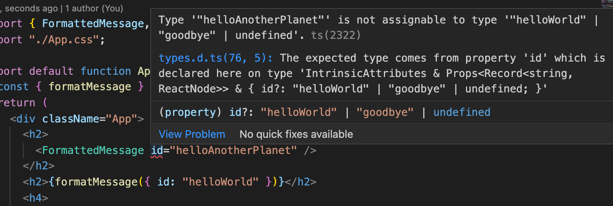

# typed-react-intl-keys

_Edit: there's a much better way to achieve type safety for react-intl keys, just [follow the docs](https://formatjs.io/docs/react-intl/#typing-message-ids-and-locale)!_

With [react-intl](https://www.npmjs.com/package/react-intl), you can translate messages with the `FormattedMessage` component or with the `formatMessage` function. Either way, you have to provide an `id` for the message, which is _ordinarily_ of type `string | number`. This means that you can pass any string or any number, even if a message doesn't exist for that ID in your translation files.

But thanks to TypeScript's `typeof keyof` we can do better...

